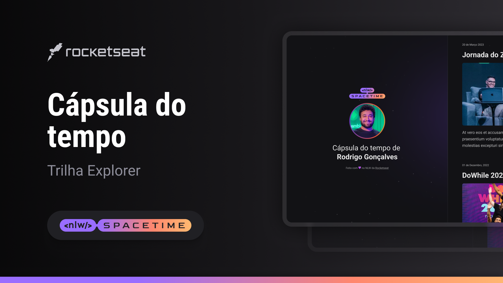

  

## 🖥️ Project
This is a Responsive Time Capsule Web Design to display memories on a timeline.

## 🚀 Technologies
This project was developed during Rocketseat's NLW with the following technologies:

- HTML
- CSS
- Git and Github

## 🏷️ Layout
You can preview the project layout through
[This link](https://www.figma.com/file/rFhymxpQq01Hj20uroRYTP/C%C3%A1psula-do-tempo-%E2%80%A2-Trilha-Explorer?type=design&node-id=306%3A84&t=I4m7dLl8DKSyWa9V-1).
[Figma] account required(https://www.figma.com)

